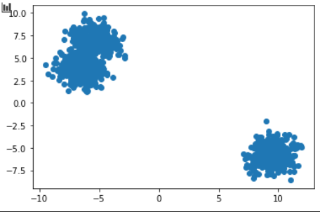
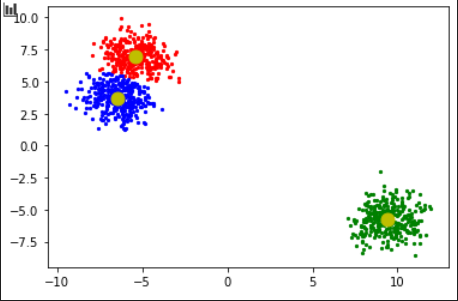
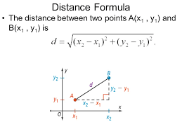
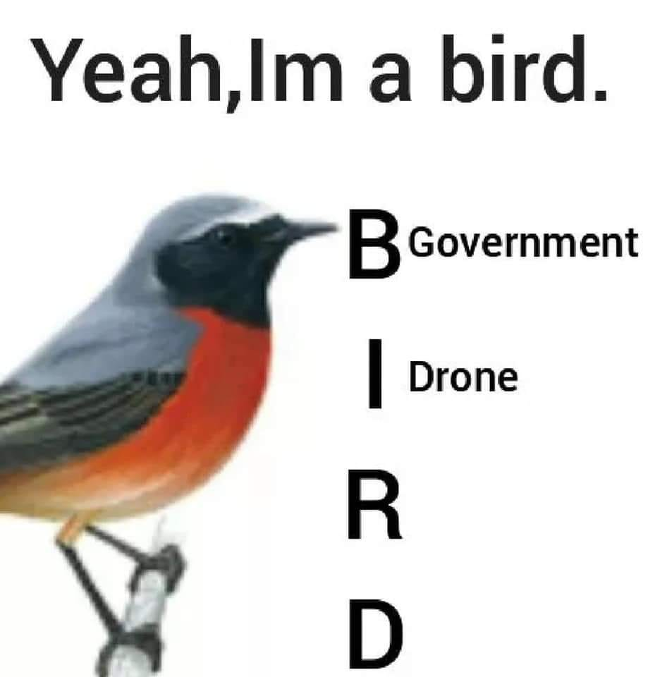

# Multidimensional-Clustering

## What's this about

This project is a part of my bachelors. It is a library for data clustering.
As i am currently not sure how my data will look like (either structurally and dimensionally),
I've prepaired myself for all possibilites.

Idea behing my bachelors is based on analysing IOT smart-house data to get some insight on
household members behaviour. 

 

But how, what does it even mean.

Easy.

## CLUSTERING ALGORITHM

Clustering algorithm is a super clever machine learning that learns patterns in data. 
Most of the people reading this will now react with: 
 

You, normal people, just like to "let machine learning in", and you think it just works, math behind it is not really important.

Also AI will kill us all, it is dangerous, we cannot let Elon Musk take over the world.

You can easly see how machine learning works on an example.

here, data 
 

now clustered 
 

yeah cool, it just works.

But does it?
It turns out that clustering is based on some CRAZY MATHEMATICS like simple mean 
.png) 
and geometric distance between two points 
 
Algorithm first chooses some random points witch are called "centroids", which are centers of now empty clusters.
Then for each point distance to all centroids is calculated, and the one closest to this point is choosen.
After clustering each point to currently random cluster, new centroind is choosen from all points in the cluster by usage of simple mean on all of them.

You still here? 
 

Lets look at some more "real life" example. Lets say you have a folder of images on your pc, but you dont know what is on these images as this folder contains tousands of images.
Ok, we used our clustering algorithm on them.

lets look how first cluster looks like 
 

nice rocks, how about second one 

 

# Horny to jail

## Use cases

As mentioned above, this algorithm is part of my bachelors. It will be used to analyse behaviour of household members.
Example use case could be a situation where a potential client using smart-house would like to know what is his Family doing right now.
Are they cleaning, working, eating dinner? With my bachelors, he could train an algorithm based on data got from his family behaviour in IOT House.
Thanks to that we've got an algorith that found patterns in human behaviour like EATING, SLEEPING, and maybe SLACKING FROM WORK. You know pobably where this is going.

 

A complete surveillance system, where machines control humans in manners we dont even understand.
At least that is how most people see this project going
## Installation
Maybe one day this lib will be pip-installable, right now you just need to use "git clone"
